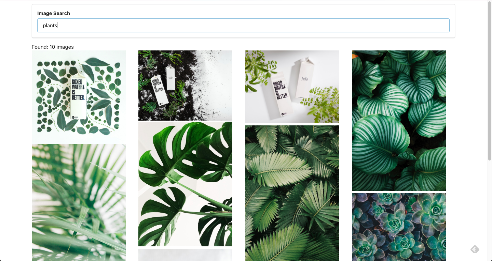

### Useful stuff in this project:

- using `axios.create` to create a custom axios client that holds all our authentication keys and base url
- styling components with semantic-ui
- simple search component connected to axios get request that queries search paramater
- using the 'load' event listener
- creating and managing React Refs to to access DOM elements and mutate attributes of rendered components with Javascript
- creating a Masonry-style layout for random images fetched from Unsplash using CSS grid

>Screenshot
